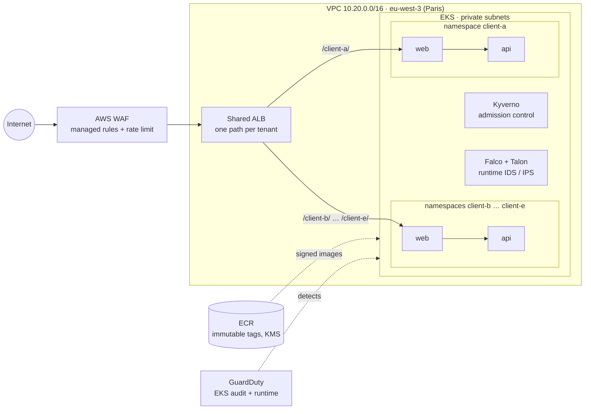
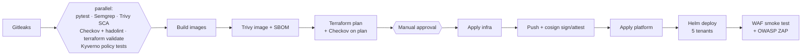

# IacDemo: secure multi-tenant platform on Amazon EKS

Five clients, each running two applications, used to live on separate servers. This project consolidates them
into **one Amazon EKS cluster with one namespace per client**, provisioned with **Terraform (AWS provider)**,
deployed with **Helm** and delivered by a **Jenkins DevSecOps pipeline**, with security controls at every layer:
code, dependencies, IaC, images, admission, network, edge (WAF), runtime (IDS/IPS) and cloud (GuardDuty).

> Based on a real architecture study: migrating several clients hosted on different servers to a single
> Kubernetes cluster, isolated by namespace.

## Architecture



| Component | Choice |
|---|---|
| Infrastructure | Terraform: VPC (public/private subnets, NAT, flow logs), EKS 1.35 managed nodes (AL2023), ECR, WAFv2, GuardDuty, KMS |
| Platform | Terraform + Helm: AWS Load Balancer Controller, metrics-server, Kyverno, Falco + Falco Talon, tenant namespaces |
| Workloads | `helm/tenant-app`: `web` (nginx, unprivileged) + `api` (Python/Flask), installed once per tenant |
| CI/CD | Jenkins configured as code (JCasC), SSH build agent, Docker-in-Docker over mutual TLS |
| Identity | EKS access entries, EKS Pod Identity for add-ons, short-lived AWS role for the pipeline |

## Tenant isolation

Every tenant namespace is created by Terraform (`terraform/platform/tenants.tf`) **with its guardrails already in place**, before any workload is deployed:

| Guardrail | What it prevents |
|---|---|
| Pod Security Admission `restricted` | privileged pods, root, host access, privilege escalation |
| `ResourceQuota` + `LimitRange` | one client starving the others (noisy neighbour) |
| `NetworkPolicy` default deny (in + out) | any traffic not explicitly allowed; cross-tenant access |
| Workload policies: ALB → web → api | only the ALB subnets reach `web`; only `web` reaches `api` |
| Namespaced RBAC (`iacdemo:<tenant>:developers`) | a client's developers seeing other clients |
| Kyverno policies | untrusted registries, mutable tags, unsigned images, missing limits |

All five tenants share **one ALB** (IngressGroup, path `/<tenant>/`), which keeps cost flat as tenants are added.

## Defense in depth

| Layer | Control | Type |
|---|---|---|
| Source | Gitleaks on the full git history | gate |
| Source | Semgrep SAST (Python, Dockerfile, OWASP Top 10) | gate |
| Dependencies | Trivy SCA; `pip install --require-hashes` | gate |
| IaC | Checkov (Terraform, rendered manifests, Dockerfiles, Terraform plan), hadolint, `terraform validate` | gate |
| Policies | Kyverno CLI tests for the admission policies | gate |
| Images | Trivy image scan (HIGH/CRITICAL), CycloneDX SBOM (Syft) | gate |
| Supply chain | cosign signature + signed SBOM attestation; ECR immutable tags; deploy by digest | prevent |
| Admission | Kyverno: trusted registry, digest only, **signature verification**, resources | prevent |
| Edge | **AWS WAF**: IP reputation, OWASP common rules, known bad inputs (Log4j), SQLi, Linux, rate limit | **IPS (L7)** |
| Runtime | **Falco** (eBPF syscalls) with a custom "shell in tenant container" rule | **IDS** |
| Runtime | **Falco Talon** reacts to Falco: isolates the pod (NetworkPolicy) and labels it quarantined | **IPS** |
| Cloud | **GuardDuty**: VPC flow/DNS/CloudTrail, EKS audit logs, EKS runtime monitoring | **IDS** |
| Audit | EKS control-plane, VPC Flow Logs and WAF logs, KMS-encrypted, 365-day retention | detect |
| Post-deploy | WAF smoke test (SQLi/XSS must get HTTP 403) + OWASP ZAP baseline | gate |
| Hosts | IMDSv2 only with hop limit 1, encrypted EBS, nodes in private subnets | prevent |

## Pipeline



Branches other than `main` run every gate up to the image scan; nothing touches AWS.
`main` adds the plan, a **manual approval**, the deployment and the DAST. A `DESTROY` parameter tears everything down in the right order (tenants → platform → infrastructure).

## Repository layout

```
├── Jenkinsfile                   # the pipeline
├── apps/
│   ├── api/                      # Flask API, tests, hashed requirements, non-root Dockerfile
│   └── web/                      # static front-end, hardened nginx config, unprivileged image
├── helm/
│   ├── tenant-app/               # web + api, installed once per tenant
│   └── cluster-policies/         # Kyverno policies + CLI tests
├── tenants/                      # client-a … client-e values (only what differs per client)
├── terraform/
│   ├── bootstrap/                # state bucket (S3 native locking) + CI role
│   ├── infra/                    # VPC, EKS, ECR, WAF, GuardDuty, KMS
│   └── platform/                 # add-ons + tenant namespaces and guardrails
├── jenkins/                      # controller (JCasC), agent (toolchain), DinD, docker-compose
├── .checkov.yaml                 # scanner config; exceptions are inline, each with a reason
└── .zap/baseline.conf            # DAST rules that fail the build
```

## Running it

**Prerequisites:** an AWS account, Docker, Terraform ≥ 1.10, AWS CLI v2, cosign.

1. **Bootstrap** (once, with an administrator profile). Create an IAM user for Jenkins whose only permission is
   `sts:AssumeRole` on the CI role, then:
   ```bash
   terraform -chdir=terraform/bootstrap init
   terraform -chdir=terraform/bootstrap apply \
     -var state_bucket_name=<unique-bucket-name> \
     -var ci_principal_arn=arn:aws:iam::<account-id>:user/<jenkins-user>
   ```
2. **Signing key:** `cosign generate-key-pair` (keep `cosign.key` out of git; it goes into Jenkins).
3. **Jenkins:**
   ```bash
   cd jenkins && ./setup.sh && docker compose up -d --build   # UI: http://localhost:8080
   ```
   - Credentials: `aws-iacdemo` (AWS credentials of the Jenkins user), `cosign-key` (secret file), `cosign-password` (secret text).
   - Global properties: `TF_STATE_BUCKET`, `CI_ROLE_ARN`, `EKS_PUBLIC_ACCESS_CIDRS` (e.g. `["203.0.113.10/32"]`, your public IP).
4. **Run** the `iacdemo` job on `main` and approve. When it finishes, open `http://<alb-dns>/client-a/`.

### See the controls in action

```bash
# WAF (IPS): blocked at the edge
curl -i "http://<alb-dns>/client-a/?id=1'%20OR%20'1'='1"            # 403

# Kyverno: an image that is not ours, not signed, not pinned
kubectl -n client-a run test --image=nginx                          # denied

# Network isolation: client-b cannot reach client-a
kubectl -n client-b exec deploy/web -- wget -qO- -T 3 http://api.client-a:8080/api/info   # times out

# Runtime IDS/IPS: an interactive shell in a tenant pod
kubectl -n client-a exec -it deploy/api -- sh
kubectl -n client-a get pods -l iacdemo.io/quarantine=true         # isolated and labelled by Falco Talon
kubectl -n falco logs -l app.kubernetes.io/name=falco | grep "Shell in tenant container"
```

### Cost and teardown

Roughly **USD 6–8 per day** (EKS control plane, 3 × t3.medium, one NAT gateway, ALB, WAF; GuardDuty after its
30-day trial). Run the pipeline with **`DESTROY=true`** when you are done.

## Checks without AWS

Everything below runs locally and in the pipeline's gates:

```bash
terraform fmt -check -recursive terraform
for s in bootstrap infra platform; do terraform -chdir=terraform/$s init -backend=false && terraform -chdir=terraform/$s validate; done
checkov --config-file .checkov.yaml -d terraform --framework terraform
hadolint apps/*/Dockerfile jenkins/*/Dockerfile
semgrep scan --config p/python --config p/dockerfile --config p/owasp-top-ten apps/
trivy fs --scanners vuln --severity HIGH,CRITICAL apps/
(cd apps/api && pip install --require-hashes -r requirements-dev.txt && pytest)
```

## Design decisions and trade-offs

| Decision | Why | In production |
|---|---|---|
| Namespace per tenant (soft multi-tenancy) | cost and operational simplicity for trusted clients | dedicated node pools or clusters for untrusted tenants |
| One shared ALB (IngressGroup) | one load balancer instead of five | same, with HTTPS (`ingress.certificateArn`) and a domain per tenant |
| Public EKS endpoint, CIDR allow-listed | Jenkins runs outside the VPC | private endpoint with in-VPC runners |
| CI role with AdministratorAccess | EKS needs to create IAM roles; the role is assume-only with 1 h sessions | least-privilege policy + permissions boundary |
| Single NAT gateway | cost | one NAT gateway per AZ |
| Kyverno at 1 replica per controller | demo sizing | 3 admission-controller replicas |
| DinD (privileged) for builds | isolates builds from the host's Docker daemon | ephemeral Kubernetes agents with rootless BuildKit |
| Signatures not sent to public Rekor | private images; digests would be public | private transparency log or keyless signing with OIDC |
| Falco Talon for automated response | upstream Falco response engine; last release is from February 2025 | evaluate its maturity before depending on it |

## Next steps

- AWS Network Firewall (Suricata rules) for egress inspection
- Forward Falco and GuardDuty findings to a SIEM (Wazuh)
- GitOps delivery with Argo CD; External Secrets Operator for application secrets
- Karpenter for node autoscaling

---

Ricardo Pilartes da Silva · [LinkedIn](https://www.linkedin.com/in/ricardo-pilartes-da-silva-54243b221/) · [GitHub](https://github.com/RicardoP24)
